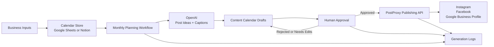

# AI Content Engine

Lightweight content automation system for local businesses.

The MVP helps a local business plan monthly content, generate post ideas and captions with OpenAI, review everything before it goes live, and publish approved posts to Instagram, Facebook, and Google Business Profile through the PostProxy API.

## MVP Scope

- Store content calendar items in Google Sheets or Notion.
- Generate monthly post ideas and captions using OpenAI.
- Support Instagram, Facebook, and Google Business Profile.
- Publish only approved posts through the PostProxy API.
- Keep a human approval step before every publish action.
- Save logs for every generated, approved, rejected, and published post.

## Architecture



## Core Components

### MCP Server

A local MCP server is available in [mcp-server](./mcp-server). It exposes starter tools for connecting AI assistants to this project.

Run it from the MCP server folder:

```bash
npm.cmd run serve
```

### 1. Calendar Store

Use either Google Sheets or Notion as the source of truth for content items.

Recommended fields:

- `content_id`
- `business_id`
- `business_name`
- `platforms`
- `content_pillar`
- `post_type`
- `topic`
- `caption`
- `visual_direction`
- `call_to_action`
- `scheduled_date`
- `status`
- `approval_notes`
- `postproxy_post_id`
- `created_at`
- `updated_at`

Common statuses:

- `idea`
- `draft`
- `needs_review`
- `approved`
- `scheduled`
- `published`
- `rejected`
- `failed`

### 2. OpenAI Generation

Two prompt templates are included:

- [Monthly Content Plan](./prompts/monthly-content-plan.md)
- [Social Post Generator](./prompts/social-post-generator.md)

The monthly planner creates a balanced calendar of content ideas. The post generator turns an approved idea into platform-ready captions, hashtags, and visual guidance.

### 3. Human Approval

Publishing must be blocked until a user manually changes the content item status to `approved`.

The approval workflow should support:

- Approving a post.
- Rejecting a post.
- Requesting edits.
- Adding approval notes.
- Recording who approved the post and when.

### 4. PostProxy Publishing

Approved posts are sent to PostProxy for publishing or scheduling. The workflow should save the response ID from PostProxy back to the content calendar.

See [PostProxy Publishing Flow](./docs/postproxy-publishing-flow.md).

### 5. Logs

Every generated or published post should create a log entry.

Recommended log events:

- `monthly_plan_generated`
- `post_caption_generated`
- `post_submitted_for_approval`
- `post_approved`
- `post_rejected`
- `post_publish_requested`
- `post_published`
- `post_publish_failed`

Logs can be stored in:

- A second Google Sheet tab.
- A Notion database.
- A simple JSONL file for early local testing.
- A database later, such as PostgreSQL or Supabase.

## Example Content Item

See [examples/content-item.json](./examples/content-item.json).

## Example PostProxy Publish Request

See [examples/postproxy-publish-request.json](./examples/postproxy-publish-request.json).

## Suggested MVP Workflow

1. Add business profile data to Google Sheets or Notion.
2. Run monthly content planning workflow.
3. Save generated ideas as draft calendar items.
4. Generate captions for selected ideas.
5. Mark posts as `needs_review`.
6. Human reviews each post.
7. Approved posts are sent to PostProxy.
8. PostProxy response is saved back to the calendar item.
9. Every step is logged.

## Environment Variables

```env
OPENAI_API_KEY=
POSTPROXY_API_KEY=
POSTPROXY_BASE_URL=
GOOGLE_SHEETS_CREDENTIALS_JSON=
NOTION_API_KEY=
NOTION_DATABASE_ID=
```

Store real secrets in your local environment or n8n credentials store. Do not commit live API keys to the repository.

Note: if the real PostProxy environment uses different variable names, update the integration layer and documentation to match the official API credentials.

## Future Enhancements

- Media asset generation or selection.
- Brand voice profiles per business.
- Approval links for clients.
- Automatic retry for failed publishing.
- Performance reporting from social platforms.
- Multi-location business support.
- Seasonal campaign templates.
