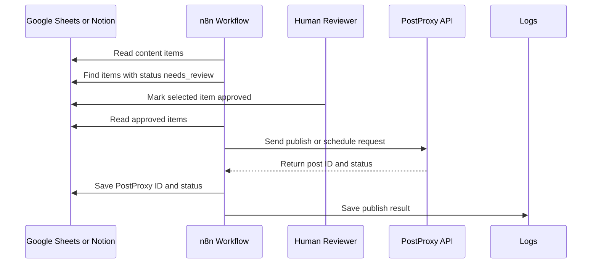

# PostProxy Publishing Flow

This document describes the MVP publishing flow for approved content.

## Purpose

PostProxy is the publishing layer. The AI Content Engine should only send posts to PostProxy after human approval.

## Publishing Rules

- Never publish generated content automatically.
- Only send content where `status` is `approved`.
- Do not publish if required platform content is missing.
- Save the PostProxy response back to the content item.
- Create a log entry for every publish attempt, success, and failure.

## Flow

## Required Content Item Fields

- `content_id`
- `business_id`
- `platforms`
- `scheduled_date`
- `status`
- `platform_posts`
- `approved_by`
- `approved_at`

## Pre-Publish Validation

Before calling PostProxy, validate:

- `status` equals `approved`.
- `approved_by` is present.
- `approved_at` is present.
- At least one supported platform is selected.
- Scheduled date is present for scheduled posts.
- Caption or body exists for each selected platform.
- Media requirements are satisfied if a media post is selected.

## Example Request

See [../examples/postproxy-publish-request.json](../examples/postproxy-publish-request.json).

## Example Response Handling

On success:

- Set content item status to `scheduled` or `published`.
- Save `postproxy_post_id`.
- Save `postproxy_response`.
- Create a `post_published` or `post_scheduled` log event.

On failure:

- Set content item status to `failed`.
- Save the error message.
- Create a `post_publish_failed` log event.
- Do not retry automatically until a human reviews the failure.

## API Notes

The request structure in this project is an integration placeholder. Confirm exact endpoint paths, authentication headers, platform names, media handling, and scheduling fields against the official PostProxy API before implementation.
